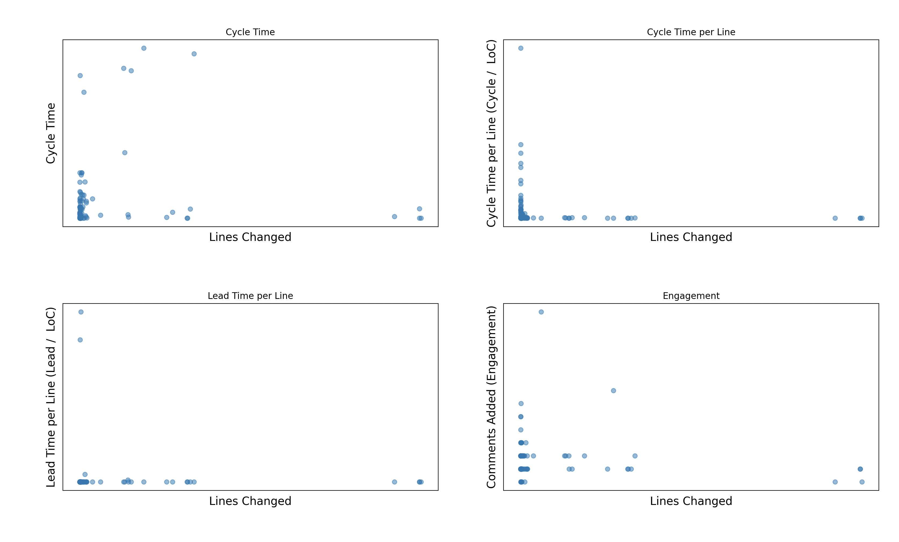

# Code Review Metrics

This is a small repository/script to help you fetch important pull request metrics.

## Setup

```bash
# Create the virtual env
python3 -m venv ./venv

# Activate it
source ./venv/bin/activate

# Install required libs
pip install -r requirements.txt
```

## Running / Using

To fetch metrics, you will need to specify either a repo to use, a custom query, as well as your GitHub token and a location to write the resulting `.csv`

You also must run the script in the `venv` context you created earlier. The simplest way is to activate the `venv` before executing the script.

```bash
source ./venv/bin/activate
./fetch-code-review-metrics.py --repo ...
```

### Options

| Options     | Description  | Example  | Default   |
|-------------|--------------|----------|-----------|
| -r, --repo  | The repository to grab pull request metrics from   | `dangoslen/code-review-metrics`  | None/Required |
| -q, --query | The query to search for pull requests. See more on GitHub's [documentation](https://docs.github.com/en/graphql/reference/queries#search). This overrides whatever was set via '-r' or '--repo'  |  `is:merged is:pr repo:<REPO>` |
| -f, --file | The path to the csv file to generate  |  `./metrics.csv` | None/Required  | 
| -t, --token | A GitHub token to access the GitHub API  | N/A | None/Required  | 

### Metrics Pulled

The following metrics or details are downloaded / computed and placed into the resulting `.csv`.

`title` - the title of the pull request

`number` - the number of the pull request

`url` - the url of the pull request

`created_by` - the author of the pull request

`created_at` - the time at which the pull request was opened

`first_reviewed_at` - the time at which the pull request was first reviewed (if it was). This is not the same as the time of the first comment on a pull request however. See more about [pull request reviews](https://docs.github.com/en/pull-requests/collaborating-with-pull-requests/reviewing-changes-in-pull-requests/about-pull-request-reviews)

`first_reviewed_by` - the first user to review the pull request

`merged_at` - the time at which the pull request was merged (if it was). 

`cycle_time_minutes` - the cycle time is the total time it took for the pull request to be merged (if it was).

`lead_time_minutes` - the lead time is the total amount of time it took between the pull request was originally created and the first review was given. 

`lines_changed` - the total number of lines changed. It is the sum of line additions and line deletions. Pull requests that are too large have a tendency to have low engagement. Large pull request also have a dual nature of being merged either very quickly or very slowly.

`comments_added` - the total number of comments added. This is a rough measure of engagement or participation in the pull request. High engagement is usually a good sign, but can also indicate too many nit-pick comments or unreasonable demands as well.

## What to Pay Attention To

### Lead Time

Lead time is the total amount of time between when a pull request is opened and the first review is added.

If the lead time is high, this likely indicates the team doesn't know about pull requests when they are created, or that they feel too busy to review pull requests. Also take into account the size of pull requests with large lead times. A pull request with many changes often requires more time for a reviewer to understand and gain context to before feeling able to review it.

Additionally, if lead time across pull requests is low and is not correlated to the size of the pull request, you might have a culture of "rubber stamping" where reviewers aren't actually reviewing code.

### Cycle Time (aka Total Wait Time)

Cycle time is the total amount of time between when a pull request is opened and then merged. Ideally, we want cycle time to be small as it indicates minimal waiting time on reviews and subsequently on authors to respond. 

If cycle time is high (especially for small pull requests), there is likely too much time waiting between feedback given and that feedback being acted upon. While pull requests are technically asyncronous, we still want a tight loop of feedback on pull request is opened.

If cycle time is low (especially for large pull requests), it also an indication of rubber-stamping, but more importantly could indicate that pull requests are simply too large. When a pull request is too large to understand, many reviewers revert to "I guess it's good" since they don't feel capable of providing helpful feedback. 

## Graphing



You can create graphs to see some of this by utilizing the `graph-code-review-metrics.py` script. 

It will show 4 different graphs

### Cycle Time

Visualization of cycle time with respect to lines of code changed. This is meant to see if the number of lines does actually affect the cycle time of the pull request.

### Cycle Time per Line

Visualization of cycle time per line with respect to total lines of code changed. This is meant to see if the total lines of code changed affects that overall cycle time of _each_ line of code. i.e. - does having 10 lines of code has a faster "cycle time per line" than 100 lines of code?

### Lead Time per Line

Visualization of cycle time per line with respect to total lines of code changed. This is meant to see if the total lines of code changed affects that overall lead time of each line of code. i.e. - if having 10 lines of code has a faster "lead time per line" than 100 lines of code? 

### Engagement

Visualization of comments added with respect to total lines of code changed. This is meant to see if larger or smaller pull requests have more "engagement" - though comments are a poor proxy for this.


```bash
# If you didn't activate you venv, do that here
source ./venv/bin/activate

# Run the script
./graph-code-review-metrics.py --file ./path/to/file.csv
```


